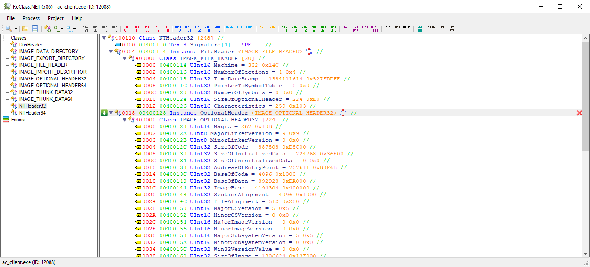
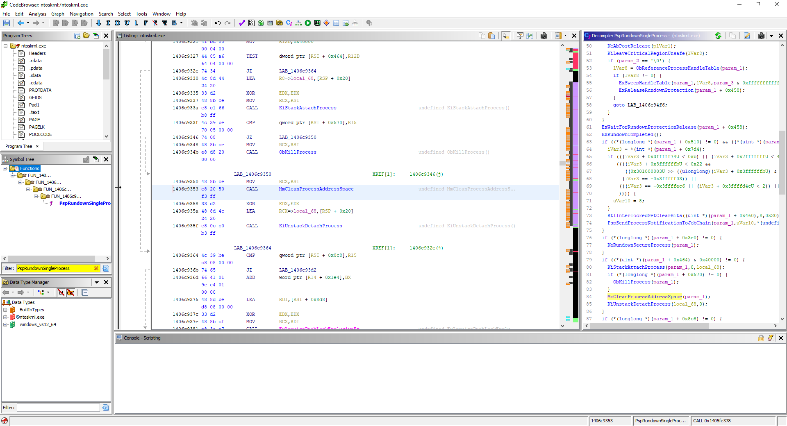

# Intro to Game Hacking #

Videogames provide a great medium for programmers to improve their skills through designing and implementing many complex systems that must be performant and act cohesively. 
In turn, videogames also serve as a great medium for fledgling reverse engineers to learn the ropes and gain practical experience picking apart those complex systems and exploiting them.

## Topics to cover (loosely ordered) ##

1. Basics
	<ol type="a">
	<li>anatomy of a Portable Executable (PE) image</li>
	<li>windows processes are containers</li>
	<li>windows image loader</li>
	<li>physical memory, virtual memory</li>
		<ol type="i">
		<li>why addresses change</li></li>
		</ol>
	<li>pointers and multi-level pointers</li>
	<li>x86-encoded instruction bytes and the x86 assembly language</li>
	</ol>
2. Hooking
	<ol type="a">
	<li>Inline detour</li>
		<ol type="i">
		<li>e9 jmp and ff25 jmp</li>
		</ol>
	<li>Trampolines</li>
	<li>Virtual Method Table (VMT / VTable) hooking</li>
		<ol type="i">
		<li>swap vtable ptr or overwrite element in vtable</li>
		</ol>
	<li>Vectored Exception Handler (VEH) hooking</li>
	<li>Hardware Breakpoint (HWBP) hooking</li>
	<li>Summary</li>
	</ol>
3. Injection
	<ol type="a">
	<li>VirtualAllocEx, WriteProcessMemory (WPM), CreateRemoteThread (CRT) @ LoadLibrary</li>
	<li>Manual Mapping</li>
		<ol type="i">
		<li>Shortcuts</li>
		</ol>
	<li>Thread Hijacking</li>
	<li>Process Environment Block (PEB) unlinking for all cases</li>
		<ol type="i">
		<li>TO-DO: move the above two into a new top-level 'Stealth' section</li>
		</ol>
	<li>Considerations for UWP apps</li>
	<li>Summary</li>
	</ol>
4. Information Gathering
	<ol type="a">
	<li>Dynamic Analysis</li>
	<li>Static Analysis</li>
	<li>Open Source</li>
	<li>All Together Now</li>
	<li>Other Useful Tools</li>
	<li>Summary And A Tip</li>
	</ol>
5. "how 2maek esp???"
	<ol type="a">
	<li>Different Ways to Draw</li>
		<ol type="i">
		<li>Directx/OpenGL hook</li>
		<li>Engine drawing</li>
		</ol>
	<li>Requirements for an ESP</li>
	<li>World to Screen</li>
		<ol type="i">
		<li>math is hard</li>
		</ol>
	<li>Externals</li>
	<li>Chams</li>
		<ol type="i">
		<li>stride, numverts, index, and depth</li>
		<li>d3d11+ equivalents</li>
		</ol>
	<li>Summary and Tips</li>
	</ol>
6. Aimbot
	<ol type="a">
	<li>Requirements for Aimbot</li>
	<li>Calculating the Aim Angle</li>
		<ol type="i">
		<li>math is still hard</li>
		</ol>
	<li>Facing the Target</li>
	<li>(Stop) Aiming Through Walls</li>
	<li>Pixel Scanners</li>
	<li>Summary</li>
	</ol>
7. Networking
	<ol type="a">
	<li>Videogame Networking</li>
	<li>Network Authority</li>
	<li>Packet Inspection</li>
	<li>Packet Editing</li>
	<li>Complications</li>
	<li>Summary</li>
	</ol>
8. (Work-In-Progress) Kernel mode
	<ol type="a">
	<li>mapping your driver & executing it</li>
	<li>reading/writing usermode memory</li>
	<li>kernel<->user communication</li>
	<li>stealth... and why you'll get caught</li>
	<li>(i'm still learning this myself)</li>
	</ol>
9. (Work-In-Progress) Hypervisors
	<ol type="a">
	<li>type 1 & type 2</li>
	<li>hijacking hyper-v</i>
	<li>(i still have to learn this myself)</li>
	</ol>
10. (Work-In-Progress) UEFI boot drivers
	<ol type="a">
	<li>(i still have to learn this myself)</li>
	</ol>
	
### Bonus Topics ###

1. Aimbot + ESP quick rundown for assault cube
	<ol type="a">
	<li>internal and maybe external?</li>
	</ol>
2. Aimbot + ESP quick rundown for an old quake engine game
3. Aimbot + ESP quick rundown for a ue4 game
	<ol type="a">
	<li>GObjects + GNames = GG</li>
	</ol>
4. Aimbot + ESP quick rundown for a unity game
	<ol type="a">
	<li>mono backend vs il2cpp backend</li>
	</ol>
5. Aimbot + ESP quick rundown for a cryengine (5?) game
6. Converting assault cube hack to kernel-mode

# Basics #

The topics covered in this section should be at least familiar to you.  
Therefore, only brief summaries will be given and links to external resources if you need to learn more.

## Anatomy of a PE image ##

|  |
|:--:|
| Image: Viewing the NT Header | 

PE images are executable modules (.exe, .dll, .sys) that contain important header metadata for the OS image loader, contain program code and data, and are often organized into sections. Although the sections are purely for organization and aren't required for the program to function, I'll list the common ones you'll most likely see. 
The .idata section contains the import table, which is what the OS image loader reads to map dependencies (and then fills out the import address table (IAT)). The .edata section contains the export table. Some compilers will put both of these in the .rdata section. Either way, you can find them by parsing the NT header's data directories. 
Code is generally placed into the .text section, initialized non-const data is generally placed into the .data section, initialized const data can be found in the .rdata section, while uninitialized data can be found in the .bss section. 
Again, this is all dependent on the compiler as sections are merely for organizational purposes: they don't effect the operation of the program. 

The following resources should be helpful if you want to learn more:
http://www.csn.ul.ie/~caolan/pub/winresdump/winresdump/doc/pefile2.html  
https://docs.microsoft.com/en-us/windows/win32/debug/pe-format

## Windows Processes ##

Processes are containers for programs and their associated data. Processes also provide a natural memory boundary. 
Each process is given its own virtual address space and the OS is responsible for translating virtual addresses to physical addresses. 
Two programs may share the same base virtual address (for example, running two instances of the 32-bit Assault Cube game you'll find the base address of each one to be `0x400000`) but won't conflict with each other because the final translation to a physical address will be different. 
Everything related to a process is stored in an EPROCESS struct which is created by the kernel during process creation. This includes the page tables (for address translation), the VAD root node, the handle table, the thread list, and the usermode-exposed PEB which contains the list of loaded modules. You don't need to be intimately familiar with the EPROCESS struct until you're ready for kernel driver development, but you should be aware that the PEB contains information on every loaded module in the process. 
One final note: when a process exits all of its resources are automatically freed by the kernel. All those people on programming forums telling you to free your memory or release your handles before exit are ultimate pedants (but it **is** a good practice to do those things ;) 

|  |
|:--:|
| Image: Processes never leak their own memory or handles | 

As for how to learn more, the latest edition of the Windows Internals book is probably going to be the best resource. 

## Windows Image Loader ##
Files are just bytes on disks, and so it is the image loader that must parse those bytes, figure out what and where the files it depends on are (and load and parse those...), and then finally hand over execution to the main entry point. 
The image loader is able to do this by having a standardized file format for executable files. For modern Windows operating systems the most common standard is the PE file format which was discussed in an earlier section. 
Through this file format, the image loader knows that important metadata will be contained at the very start of the file (and that metadata will point to other important metadata at other positions within the file). Such metadata includes various flags indicating whether the image is x86 or x64, whether it's large-address aware, whether it's a GUI app or console app, as well as the Import Table which defines every module and function within each module that the program depends upon. 
For a basic level of understanding the only things you need to know are that files are bytes on disk, executable files use a standard file format, and the image loader (which runs in usermode) parses those files to recursively load dependencies and do other initial setup work before handing execution over to the main entry point. It should be noted that some equally important work is done in kernelmode to create the process, which is part of the general 'image loading' process, but in this guide I refer specifically to the usermode part as the 'image loader'. 

For additional resources, again, the Windows Internals book is great. But thankfully, you'll also find some great posts online. So look for stackoverflow questions, forum posts, github repos of manual mappers (more on those later).

## Memory ##
You should be familiar with the concept of virtual memory. As mentioned in the section on processes, you should also be aware that each process is given its own virtual address space.  
Basically, modern consumer operating systems use the virtual memory management model. This is a whole thing. There are books about just this. I don't know everything about how or why virtual memory works, but basically, under this model, memory is divided into chunks called pages. Regular pages are usually 4KB but there are special 'large' pages which are 2MB (and there are huge pages which are 1GB, but I don't think many OS's support those). The CPU provides and enforces page protection levels.  
Accessing data is a long and complicated process, but it all boils down to the CPU checking if the virtual page is already backed by (or 'is resident in') physical memory, and if not it will generate a page fault which is handled by the OS kernel. The kernel, then, fetches the page from the pagefile if it exists and makes it resident in physical memory or passes an exception to the executing process.  
The tracking of virtual memory, physical memory, and paged memory is very important and very time-sensitive, so special look-up structures are defined by the CPU manufacturer (which the OS's must conform to). These structures are the page table entries, the page tables, the page directories, the page directory pointers tables, and the page map level 4s. The CPU maintains a cache of these structures in what's called the translation lookaside buffer (TLB). If a mapping can be found from the TLB then the whole process is much quicker. If not, however, that's when the page fault is sent to the OS. The OS, if it's able to fetch the page from secondary storage, then updates the page table entry and the TLB and asks the CPU to try translating again.  

Each element in the PML4 points to a PDPT. Each element in the PDPT points to a PD containing PDEs. Each PDE points to a PT. A PT is a simple array of PTEs. So is a PDPT and PML4. Every PT has 512 PTEs and each PTE maps a single P (4kb).

Good resources for learning more: Windows Internals book, Intel Software Development Manual, Wikipedia, various OSDev wikis or forums.  
(This is something I'm still learning too, so don't feel deterred if you feel lost right now).

## Pointers ##
This guide assumes you have prior programming experience dealing with pointers. Don't sweat it if you mess them up sometimes. Everyone does. I mess up pointer arithmetic at least once per project. You should be comfortable with this exercise: given an address (eg; 0x410000) read the first 4 bytes. Bonus points if you can read the first 4 bits.

## x86 Assembly ##
CPUs read bytes. Bytes are the words of their language. But just like our words have meaning, so to must their bytes. That is where 'instruction sets' come in.  
The x86 instruction set is the most common instruction set used by consumer CPUs.  
The x86 assembly *language* is a set of mnemonics that translate to x86-encoded instruction bytes.  
The human-readable `mov eax, 1` will compile to bytes `B801000000` and that's what will be stored on disk and eventually parsed by the CPU if executed.  
Disassemblers, then, take those bytes and try to figure out which mnemonic it came from.  
Refer to the Intel Software Development Manual (intel SDM) for details on specific encodings on an as-needed basis. There are also websites that try to condense everything into one page which you can usually find by googling something like 'x86 mov instruction encoding'.  
This guide will assume a basic knowledge of what each common mnemonic does (mov, jmp, call, push, pop, etc) and also how indirection works in the assembly language.  
It's worth noting, before moving on, that many disassemblers will provide a decompiler which attempts to figure out the higher-level language (usually looks like C/C++ but it's really just pseudo) code which might've produced the instruction bytes.  
Ghidra is a free, open-source, and popular disassembler that includes a really high quality decompiler too.

# Hooking #

The art of making someone else's code execute your code instead.

## Inline Hooking ##

An inline hook is one in which a jmp to your hook function has been written over some instruction bytes in the target function (usually at the very top of the target function).  
Because you're overwriting instruction bytes that may be executed at any time you'll need to first suspend all threads other than your own. Furthermore, because CPUs like to cache things, it's also a good idea to flush the instruction cache after you've written your jmp instruction. Lastly, remember that bytes in the .text section usually have only RX page protection, so you'll need to modify the page protection to RWX, write your jmp, then set the page protection back to its original value.
Furthermore, you should be aware that not all jmp instructions are the same. There are near and far jmps which have the further modifier of relative, or absolute indirect, or absolute. If you're working with a 32 bit address space, a near relative jmp should be fine, but if not then you should make sure that the distance between your target function and hook function isn't greater than the max offset of a near relative jmp. This is one case where you'll definitely want to refer to the intel SDM to find the specifics of each jmp encoding.

### TO-DO ###
Image of before and after control flow

## Trampolines ##

Often you'll want to call the original function at some point in your hook function, but you'll find if you do that you'll eventually hit a stack overflow exception. Your hook calls your target which is hooked so execution winds back up in your hook which calls your target which... eventually, all those calls will exhaust the stack and generate that exception.  
So you have two options: either unhook your target function, call it, then re-hook it, or simply write a 'trampoline' and call your trampoline.  
A trampoline is simply a copy of the instructions that your hook overwrote in the target function followed by a jmp to the position in the target function just past your hook. This allows the full target function to execute without going into the infinite loop of jmp'ing to your hook.  
Of course, because instructions are just encoded bytes, how can you know which bytes comprise a full instruction? Or rather, where does one instruction end and the next begin? This is where you'll need to employ a disassembly engine. Popular ones include `hde` and `capstone`. You'll feed the disassembly engine the bytes and it'll feed you the instructions. With that, you should have all you need to write your trampoline. Again, though, make sure you're using the write jmp encoding in your trampoline.  

Ah, this was written with inline hooks in mind but trampolines can be used for other types of hooks too. For example, if you have a hardware breakpoint set on the first instruction of the target function, your trampoline would need to have a copy of that instruction and then jmp to the second instruction of the target function. This will, again, allow you to call the original target function without it executing your hook function.

### TO-DO ###
Image of before and after control flow of an inline hook, including the trampoline

## Virtual Method Table Hooking ##

If your target program is a C++ program, you may find that your target function is a virtual class member function. If you're familiar with the low-level details of C++ you'll know that any class instance that has virtual member functions will have a pointer to something called a Virtual Method Table (VMT) containing pointers to each virtual member function. This pointer to the VMT is always the first field of the class instance in memory.  
With that knowledge in hand, it should be obvious that if you could obtain a pointer to that class instance you could then copy their virtual method table, modify the entry pointing to your target function to point to your hook function, then replace the class instance's VMT pointer to point to your modified VMT.  
However, there is an even easier way. If you don't want to make a copy of the entire VMT you could simply modify the target function's specific entry within the original VMT in-place to point to your hook function.  
As with all hooks, you should always suspend all threads besides your own before doing this. However, because this isn't overwriting any *instructions* you don't need to flush the instruction cache. This is why this is often referred to as a 'data hook' - you're only modifying data, not instructions.  

### TO-DO ###
Image of VMT, maybe image of how a virtual function is often called in assembly

## Vectored Exception Handler Hooking ##

Windows debugging API allows you to register your own exception handler. You can register an exception handler and then intentionally trigger an exception using a variety of methods.  
One such method would be to mark the page containing your function as a guard page or no-access page. In your exception handler you then step through until you reach your target function then call your hook function. Not every exception triggered will lead to your target function - pages will almost always contain a multitude of other functions. Furthermore, exceptions can and do occur normally as part of program operation, so your exception handler must handle all cases gracefully.  
Another way of triggering an exception is to overwrite the first byte of your target function with `0xCC`. This is the special INT 3 instruction used by debuggers to trigger breakpoints at specific instructions. The benefit of this method is that your exception handler can be simplified: since you know *your* exception will only occur at the address you wrote the INT 3 instruction, you can pass the exception to the next handler whenever the XIP doesn't match. The drawback of this method, of course, is that you're still overwriting instructions like in the inline hook.  
No matter which method you use to trigger an exception, you should keep in mind that exceptions are expensive so these hooks tend to slow down the program if it's used on a function that's called very often.

## Hardware Breakpoint Hooking ##

This is very similar to the Vectored Exception Handler Hooking. Except instead of purposefully generating an exception, you are using the debug registers associated with each thread. Unfortunately, there are only 4 debug registers available. The configuration of each breakpoint must be carefully set in dr7 using bitwise operators.  
Bits 0, 2, 4, and 6 should be set corresponding to which debug register you're using for your hook.  
Next, there are 2-bit flags to define when you want your breakpoint to trigger. For a hook you want these flags to be `00` indicating a trigger on execution. These bits are 16&17, 20&21, 24&25, and 28&29 again corresponding to which debug register you're using for your hook.  
Finally, there is another 2-bit flag to define how large of an area should be watched for your breakpoint to trigger. For a hook this can just be `00` again indicating one byte. These bits are 18&19, 22&23, 26&27, and 30&31 again corresponding to which debug register you're using for your hook.  
The benefit to this is you aren't modifying anything other than the thread context. No data, no instructions, no page protections. The drawback is that it's still an exception and so it's still more expensive than an inline or VMT hook.

## Summary ##

We've only covered the most popular hooking methods here. There are probably countless ways of altering control flow to execute your code. I encourage you to think about the other possibilities. In the end though, you shouldn't feel any pressure to come up with something totally unique. These methods covered are popular and get the job done 99.99% of the time :).

# Injection #

Shoving your code some place it doesn't belong.

## Making the target call LoadLibrary for you ##

I don't know the actual name for this particular technique, but it's by far the most common and perhaps oldest.  
Your injector allocates enough memory in the target process to hold your dll's path string, then writes the path string into that allocated memory, then creates a thread starting at the address of LoadLibrary passing it the address of that allocated memory.  
The effect is that the target process will call LoadLibrary on your dll.  
One thing to take care of is that if your injector is 64bit and the target is 32bit then the address of LoadLibrary in your injector won't match the one in the target. Vice versa is true as well. So I recommend walking the target process' module list to find kernel32.dll then parse its EAT to find LoadLibrary.  
As for downsides, this method involves winapi calls in the target process so if there is any kind of security it'd be trivial to detect this (and even block it completely).

## Manual Mapping ##

Remember the OS image loader? Well, this technique involves re-creating it :) 
This is one case where you'll definitely want to look up additional resources or do some reversing yourself. The windows image loader has changed quite a bit between OS versions so it seems entirely possible it could continue to change in the future. The core ideas should remain the same, though:
1. Read the image into your injector process
2. Allocate space for image in target process
3. Apply relocations if necessary (according to the .reloc section)
4. Enumerate imported modules and check if they're loaded in the target process already
	<ol type="a">
	<li>If not, then try to resolve its path according to Window's own DLL search order and then load it starting from step 1.</li>
	</ol>
5. For each module mapped, fill in its IAT. This involves looking up each imported function in the imported module's EAT.
6. Make exceptions possible (SEH and VEH)
7. Handle TLS entries
8. Invoke each module's TLS entries
9. Invoke each module's entrypoint

Steps 6, 7, and 8 aren't *strictly* required but they're nice to have. If a module does anything meaningful with TLS data then 6 & 7 would be necessary, but I'm not sure how frequently you'd encounter that.

The big issue to solve, in my opinion, is path resolution. Imported modules are stored in the image's Import Table with only the filename (eg; `KERNEL32.DLL`) so you need to resolve that to `C:\\Windows\\System32\\kernel32.dll` or `C:\\Windows\\SysWOW64\\kernel32.dll`.  
It becomes even more complicated when you encounter an import named `api-ms-win-crt-math-l1-1-0.dll`. This would (at the time of writing) need to resolve to `C:\\Windows\\System32\\ucrtbase.dll` or `C:\\Windows\\SysWOW64\\ucrtbase.dll`. That's one of the things introduced to the image loader in a recent version of the OS: API sets.  
Additionally, SxS images add another complication. SxS images are either stored next to a manifest or often have a manifest file embedded. This manifest file effectively overrides the image search order.

As for detection, since you won't be linking your module to the PEB it won't show up in any module snapshot. However, the memory allocated by VirtualAlloc could be seen, and the thread that executes each module's DllMain (or any that you create later) could be seen. If you do any hooking then of course that could be seen as well. Memory allocations aren't necessarily a huge red flag, so the main concern is the detection of your threads. Generally, manual mapping is an effective way to evade actions from most usermode anticheats.

### Shortcut ###

One common thing you'll see in a lot of open source manual mappers is a call to LoadLibrary for each imported module. This certainly makes things easier as you don't need to do any path resolution, but you're invoking the Windows image loader with your call to LoadLibrary (or LdrLoadDll) and that kind of defeats the purpose of writing a *manual* mapper, doesn't it? 

## Thread Hijacking ##

This isn't so much 'injection' as it is just a way of executing your injected code (or any code), but I'm throwing it in the 'injection' section anyway.

The principle of thread hijacking is simple:
1. Enumerate threads associated with the target process
2. Pick one, the best one, the main one and suspend it.
3. Call `GetThreadContext`
4. Modify the instruction pointer to point to whatever code you want to execute
5. Call `SetThreadContext` with the modified context
6. Resume the thread

Of course, that thread is now garbage because it can't return to where it was. So you'd be best off running an infinite loop and taking over the processs.

Unless you save and then restore all registers once your code has finished executing. Then the thread you hijacked can return to where it was.

The benefit of doing this is that you aren't creating any additional threads, so you're minimizing your detection footprint. Another benefit is if you're operating externally but want to hide within a 'trusted' process, you can hijack a thread in that trusted process and take over - this is similar to process hollowing.

## Unlinking from PEB ##

Depending on how you inject, your module may be placed in the PEB's Ldr module list. You can remove it to prevent your module from showing up in any snapshots.

## UWP Apps ##

UWP apps have different security access descriptors. If you're trying something and can't figure out why it's not working then check to see if you're dealing with a UWP app. Then research all the differences between native processes and 'modern' processes to figure out the workarounds.

## Summary ##

This is a relatively small section covering just two injection techniques with some bonus topics thrown in. There are so many more techniques to learn, but I've found the two I covered here to be more than enough. If you're interested in this topic I highly recommend going down a rabbit hole researching all the different techniques though. Doing so would expand your knowledge of the OS too.

# Information Gathering #

Injecting your code and hooking game functions are two pieces of the puzzle, but the question still remains: how do you know where to install your hook or how to access game data like player positions or health? 

## Dynamic Analysis ##

Dynamic analysis involves reading the memory of a running process and/or attaching a debugger to step through its code. It could also involve network packet inspection. Some people even go further and install hooks in important kernel functions (after disabling KPP) to log in real-time every little thing the target does, but I don't have any experience with that. 
My preferred tools for dynamic analysis include [ReClass.NET](https://github.com/ReClassNET/ReClass.NET), [cheat engine](https://www.cheatengine.org/), and [windbg preview](https://www.microsoft.com/en-us/p/windbg-preview/9pgjgd53tn86). ReClass is for viewing and mapping out data structures, cheat engine is for searching for specific values in memory, and windbg is for debugging. Cheat engine's debugger is pretty good too and I may often use that when it's available, but windbg will be necessary later when dealing with kernel stuff so it's good to build experience with it.

## Static Analysis ##

Static analysis involves reading the executable file on disk. It could also include looking for log files generated by the target process. 
I prefer using HexRays IDA for disassembling and decompiling, but [Ghidra](https://github.com/NationalSecurityAgency/ghidra) is a great (free) alternative that's becoming more and more popular. 
If I'm working with any .NET images then I'll use [ILSpy](https://github.com/icsharpcode/ILSpy) with the [reflexIL plugin](https://github.com/sailro/Reflexil) for making changes (if possible). Most .NET disassemblers have decompilers built-in, too, if you're working with a .NET image instead of a native image. IDA and Ghidra also have .NET decompilers, I think, but I prefer ILSpy so I don't have much experience with them. 

The value of having a decompiler (not just a disassembler) cannot be understated. IDA and Ghidra both have great decompilers capable of turning boring, meticulous assembly into pseudo-C code. Not only does this take away the eyesore of assembly, but it also makes the logic easier to understand. Trying to figure out what a function does by looking at it in assembly form might take half an hour, but running it through the decompiler and reading it in pseudo-C form might reduce that down to just 5 minutes. It's truly a game changer.

## Open Source ##

Many game engines are completely open source. Many games also use open source packages, too, like networking libraries, input libraries, or scripting engines. If you can identify what the game is built with then you can look to see if it's open source. With the source code in hand, information gathering becomes so much easier. Keep in mind there may be changes between the published source code and the code used in whatever game you're looking at. Usually these are small changes, like a struct having an additional 4-byte field somewhere, or a function might be compiled to different assembly instructions but still ultimately does the same thing in mostly the same way. 
Also, keep in mind that even if a game engine isn't open source but is still free to use then it might be worth downloading it and building a simple game to see if it'll provide you with symbols for debugging. Loading symbols into your preferred disassembler is almost just as good as having the source code. To be clear, you'd load *your* simple game into the disassembler and load the *.pdb. The goal is to figure out how the engine works which you can then apply this knowledge to the actual target game.

## All Together Now ##

Dynamic analysis, static analysis, and source code can all be used together at the same time to make information gathering extremely efficient. 
I'll often use a dynamic analysis tool to scan for my player character's health or position and once I find it and figure out what writes to it then I'll translate the address of that function to its filetime address and look at it in my static analysis tool. If the game is using an open source engine then I'll look for nearby strings and search for those strings in the source code, too. Very quickly I'll have an understanding of exactly what's happening, what the call chain looks like, all the structures referenced throughout the chain, etc. 
This is just an example but you can see how using all these tools together can make your life easier. 
Before moving on, I also want to note that even without source code it's not a bad idea to look at all the referenced strings in the image with your static analysis tool. Often times debug strings will lead you to very juicy functions that reference all kinds of structures you might be interested in.

## Other Useful Tools ##

For unity games built upon the il2cpp backend, [il2cppinspector](https://github.com/djkaty/Il2CppInspector) by djkaty is a great tool. It can generate a fully functional DLL project with all of the game's (and engine's) structs and functions defined. 
For flash / adobe AIR games I recommend [ffdec](https://github.com/jindrapetrik/jpexs-decompiler). It includes a pretty good decompiler and also lets you view and modify the actionscript bytecode. 
For Java games I've used [recaf](https://github.com/Col-E/Recaf), [jd-gui](https://java-decompiler.github.io/), and [jbe](https://set.ee/jbe/). They all accomplish the same goal, but I've found some have trouble with certain versions of java. Recaf is probably the most updated one followed by jd-gui. 
For dumping games in memory (useful if the game is packed on disk) I use [Scylla](https://github.com/NtQuery/Scylla), but any dumper should do. 
For viewing process properties (like checking its protection status and security tokens) I use [processhacker](https://github.com/processhacker/processhacker). I've used this mostly to verify that my injector process gets the highest level of protection (PsProtectedSignerWinTcb) before I try to get a handle to a certain protected game. 

## Summary And A Tip ##

Hopefully this section gave you some ideas of how you can hunt down the information you're looking for. 
As a tip (and a recommendation), I strongly urge you to consider writing a program that defines several different structs of varying complexity: one struct with just plain data members, another struct with plain data members *and* pointers (that are actually pointing to something!), a third struct with strings and integer arrays, a fourth struct with virtual member functions, and a fifth struct with inheritance. Instantiate instances of these structs and print their addresses. Then, point ReClass.NET at these addresses and **learn**. This is by far the best thing you can do when starting out. 

From this point on, the guide will be focused more on practical topics instead of theoretical topics, and I'll try my best to adjust my writing to reflect that with more thoroughness and directness.

# "how 2maek esp???" #

An ESP cheat (short for extra-sensory perception) is one that provides you with some information you wouldn't normally have. Typically this is implemented as a bounding box drawn around players even if you don't have line of sight on that player. Sometimes instead of a bounding box it'll be an outline or even overriding the drawing of the player texture to draw it as a bright color with depth disabled (this last example is commonly referred to as 'chams'). You could even draw a radar - providing a top-down view of the world and the positions of the players on it.

|  |
|:--:|
| Image: Name & Box ESP w/ some debug info drawn on screen | 

## Different Ways to Draw ##

Drawing can be accomplished by taking one of many paths. 
You can hook a game's core drawing function and make use of its own drawing functions. 
You can hook directX's Present function or openGL's wglSwapBuffers function (or whatever other function that gets called every frame - I don't have much experience with openGL) and do your own drawing, too. You could initialize imgui and use imgui's drawing functions or write your own. 

### TO-DO ###
- [ ] Detailed walkthrough of setting up a directx and openGL hook

## Requirements for an ESP (Internal) ##
This assumes you're already able to inject your code into the process, so the requirements for injection won't be listed. 
This also assumes you only want to draw a string at each player's position (name ESP).
1. A game function you can hook that gets called every frame.
	<ol type="a">
	<li>For engine drawing: a render function you can hook. Ideally, this function will already have the proper graphics state setup for drawing. If not, then you may have to figure out how to set up the graphics state yourself (and then set it back to whatever it was before your hook calls the original).</li>
	</ol>
2. A draw text function. This can either be: finding an engine function to call, writing your own via openGL / directX, or using a library like imgui.
3. The address of the local player instance.
4. The address of the player list or entity list.
	<ol type="a">
	<li>If entity list: figuring out enough of the entity struct to be able to determine what <em>type</em> of entity it is.</li>
	</ol>
5. Figuring out enough of the player / entity struct to read its position.
6. Some way to calculate screen coords from world coords. This can either be: finding an engine function (often named Deproject or something with Transform in it), finding the model view projection matrix, or constructing the model view projection matrix by finding its component values (or making educated guesses).

Once you break the task down into small steps like this it doesn't seem so difficult, right? I like to copy this check-list into every new project I work on. 
Now I'll try to explain the biggest challenge of ESP: the world to screen transformation.

## World to Screen ##
Player positions are kept in world coordinates. We usually draw things using screen coordinates. So we need to figure out how to transform world coordinates to screen coordinates. Thankfully, the game must also do this as part of its rendering pipeline (the GPU has no idea about world space, it only knows screen space) and so important data structures used in this transformation should already be present for us to use. That would be the model, view, and projection matrices. 
**The model matrix** (also known as the world matrix) is a matrix representing the transformation from model space to world space. Model space is the space the artist was working with in their modeling software when building the model. Its inputs include the position, rotation, and scale of the object. 
**The view matrix** is the inverse of the camera object's world matrix. It's responsible for transforming world-space into camera-space (also known as view-space). Essentially, it positions objects to be relative to the camera, including the camera object itself which will be positioned at the identity matrix (0,0 staring down the Z axis). Different cameras are positioned differently. FPS cameras are usually positioned at the player position plus an offset to make it "eye-level". TPS cameras can be positioned looking over the top of the player's shoulder, or they can be freely orbitable around the player at a fixed or variable distance. A look-at camera is used in games that feature a lock-on system. Keeping these differences in mind can make it easier to track down or guess at the construction of the view matrix. Also keep in mind some games might not represent the camera as a separate 'object' in the scene but the principles remain. 
**The projection matrix** is set up when initializing the perspective projection of the scene. Its inputs include horizontal and vertical FOV, aspect ratio (screen width divided by screen height), and near and far clipping planes. This is probably where the most math comes from and I suck at math so I can't even explain how perpsective projection works. Thankfully, you don't need to be a mathematician nowadays because all of it is wrapped up neatly into nearly every graphics API or library. We just need to guess at what inputs the game uses. 
Common horizontal FOV values are 65, 80, and 90 but I've noticed more modern games are experimenting with all kinds of different values here. Of course, the FOV is also often adjustable by the user in the game settings. 
Vertical FOV is usually calculated from the horizontal FOV, but I think I've seen some games allow the user to adjust both independently. 
The near clipping plane value is usually 0.10 or 0.30 and the far clipping plane value is usually a much larger number like 100.00, 450.00, or even 1000.00.

By multiplying all three matrices together and then multiplying that by our world position we'll get our converted screen position. The Z component (or W component depending on how you do your multiplication) tells us whether the object will be clipped or not (if it's off-screen it'll have a value of zero [or less? I usually just check if it's less than 0.1]). 
There is a lot of math involved and I have really weak math skills so I do a lot of trial-and-error and guesswork for this. Every time, every game. I have no shame in this, I only wish I paid more attention in math class. Don't feel bad if you need to google or copy-paste other people's world to screen functions. Just give credit when you do.

## Externals ##

This guide usually assumes you're making an internal cheat: one that you inject into the game process. However, external cheats are quite common and can be just as effective, too. 
For externals, you'll want to create an invisible window overlaying the game window. From there you can setup whatever graphics API you'll be using: GDI, directX, openGL, or imgui on top of any of those. 
Other than that, you'll still face the same requirements of needing to iterate the player / entity list, reading player positions, and transforming world positions to screen positions.

### TO-DO ###
- [ ] Make note of strange wording in winapi functions dealing with 'transparency', and how to properly set up the invisible overlay window.

## Chams ##

Chams are quite a distinctive ESP cheat and they can be somewhat universal too with hardly any additional coding required for different games. 
The idea is to hook DrawIndex or DrawIndexedInstance as these are called per-model, and then in your hook call IAGetVertexBuffers, IAGetIndexBuffer, PSGetConstantBuffers, and VSGetConstantBuffers and use as many unique values as you can to identify specific models. Once you've identified the values associated with player models then you can filter those and call OMSetDepthStencilState and PSSetShader to draw that model as a flat color with no depth (so you can see it even through walls). 
Keep in mind that things like LOD or texture streaming can result in a model having multiple sets of values depending on how far away it is or other in-game conditions, which is one of the biggest drawbacks of this method. 
Ah, this section assumed directx, but I'm sure equivalent functions exist in openGL too.

|  |
|:--:|
| Image: Chams have a unique visual appeal | 

### TO-DO ###

- [ ] how to do the same in openGL

## Summary and Tips ##

Rendering is an extremely complex and deep subject, but as you've seen we can leverage what's given to us to simplify the work considerably. 
If you're interested in graphics programming, I'd recommend checking out [this series of free tutorials](https://www.rastertek.com/tutdx11.html) that walks you through setting up directX, importing and parsing 3D models, importing and parsing textures, and various important graphics techniques like lighting, culling, reflections, particle effects, and more.

### TO-DO ###
- [ ] Include tip on how to find player / entity list

# Aimbot #

Knowing where your enemies are obviously confers a huge advantage, but what if you can also remove the need to aim at them? An aimbot is a type of cheat that automatically moves your cursor to the enemy. You can also add rules for selecting which enemy to aim at such as closest by distance, closest by angle, only enemies within a certain angle, etc.

## Requirements for Aimbot (Internal) ##

1. A game function you can hook that gets called every frame.
2. The address of the local player instance.
3. The address of the player list or entity list.
	<ol type="a">
	<li>If entity list: figuring out enough of the entity struct to be able to determine what <em>type</em> of entity it is.</li>
	</ol>
4. Figuring out enough of the player / entity struct to read its position and angle (pitch and yaw) as well as the spatial offset to where bullets come from (the eyeheight in some FPS games).
5. A function to calculate the angle you need to rotate by in order to be looking at the enemy (this is the math part).
6. A way to rotate your character.
7. (optional) The engine's traceline / raycast function to determine if any collidable object is in the path between you and the target.

You may notice the first four requirements are shared by ESP cheats, so if you're building both an ESP and aimbot there isn't as much work as it may seem.

## Calculating the Aim Angle ##

As mentioned in the requirements, this is **the math part**. If you read the ESP section you should already know math is not my strong suit. That said, I feel like understanding this part is slightly easier than understanding perspective projection. However, I still find myself having to look up how other people do it when the formula I'm used to doesn't work for whatever reason. Again, I just build up a collection of formulas and do a lot of trial-and-error testing until I find the one that works with the game / engine I'm working on. 

The core idea is that your player character is at a certain position and your target character is at another position. You need to determine at what angle your character must face to be looking at the target character. 

### TO-DO ###
Move this to a new 'General Game Reversing' subsection in the Information Gathering section, and rewrite it to make it fit: 
Something I forgot to mention in the ESP section is that a player's position may not necessarily be part of the player struct. Modern game engines abstract nearly everything, even to the point that there is no 'player' struct. So what you may find is the root 'object' associated with the player and then a bunch of attached 'components' that define that object as a 'player object'. One of those components may be something like a 'Health' component that stores the player's health, armor, and handles everything to do with taking damage. Another component may be the 'Transform' component that stores the position and rotation. One of the challenges with reverse engineering modern games is peeling back these complex layers of abstraction. Since every engine is different, I can't offer more advice other than "be aware that abstraction exists".

## Facing the Target ##

Once you know how much you need to rotate your character, you then need to figure out how to actually rotate your character with code. 
There are a few approaches:
1. Use mouseeventf / SendInput to programmatically move your mouse.
2. Use an engine function to rotate your character.
3. Set your character's angles directly (essentially what the engine function would be doing).

The first approach should be the least desirable: it relies on winapi functions and the movement will be marked as 'injected' so it could easily be ignored by the game or detected by any anticheat. If you do go this approach, you'll need to refer to the msdn page about mouse coordinates. There's a translation process you'll need to do. 
The second approach is good but requires finding such a function and if you've got the player's rotation fields anyway then it'd be best to just go with the third approach and save yourself the tiny overhead that comes with function calls. That said, there are some cases where this approach will make sense, like if there's too much abstraction for you to make sense of and you just want to get it working. (can you tell I'm speaking from experience?) 
The third approach is probably the most common and most desirable. You just set your character's angles directly to the required aim angle.

There are probably other approaches but I haven't experimented with them. There's a type of aiming called 'silent aim' but I haven't looked into it too much, I think it just abuses some specific weakness of the game engine where spectators see one thing but the part of the server that runs hit detection sees another thing. Might be wrong.

## (Stop) Aiming Through Walls ##

The first aimbot you'll make will probably lock onto enemies through walls. At some point this will become very annoying. You might try adding filters to only aim at enemies within a certain aim angle, but you know that's only a band-aid solution. So how do you solve this permanently? Physics! Thankfully we don't need to know any actual physics, we just need to find the part of the game / engine that **does** know physics. 
The specific part I'm talking about is commonly called the TraceLine / Raycast / Raytrace / Linecast function. Essentially, this function will throw out an invisible laser beam starting from an origin position and traveling along whatever direction for some distance (or infinite distance). If that beam touches any **collidable, physical object** then the function will return that information to you. 
Since this is an engine function, specifically a physics engine function, it's extremely difficult to replicate this in an external cheat, so this is often only used in internal cheats (or an external cheat that injects shellcode to call the function, at which point I don't consider it to be 'external'). 
A tip for finding this function: make note of any part of the game where looking at something will cause a prompt, label, or something else to appear. 
Some examples: aiming at a door will cause "Press F to open" to appear, aiming at a teammate or enemy will cause their name to appear above their head or elsewhere on the screen, aiming at a teammate or enemy will cause your crosshairs to change from white to green or red or whatever color. 
You'll want to verify that this change occurs as a result of you **aiming** at the thing, not just by being close to it or by reaching some specific game state. If the prompt appears even if you're aiming at the sky then it's likely due to proximity, for example. 
Once you've figured out a place where this occurs then you've got the challenge of finding the function call responsible. Maybe try finding what accesses the string or what writes to the color of the crosshairs. Or find whatever function handles the interaction and work backwards. Using the door example, find the function that opens the door when you press F and recognize that the same function, or one of its callers, also probably calls the Raytrace function to determine that you are actually looking at the door when you press the F key. Maybe you'll start with the core input handler itself and work forwards instead of backwards. Or maybe the game / engine you're working with is open source and you can just look for it in the source code and find any hardcoded strings nearby that you can cross-reference. 

## Pixel Scanners ##

This is usually a type of external aimbot, but sometimes it's done internally too. Basically it takes a screenshot of the game and looks for patterns of pixels associated with player characters and then aims there. Obviously, this is **extremely** inefficient and error-prone (what happens when you turn post-processing effects on? Suddenly the pixels don't match anymore). Not only is it computationally expensive to run **any** image processing (even just iterating pixels and performing comparisons), it's also quite expensive to capture these screenshots in the first place, so this method should be avoided at all costs. 
Furthermore, even just gathering the patterns of pixels to look for requires a lot of manual labor because of things like lighting and distance. 
Still, the benefit of this is similar to that of chams: you don't need to do any reverse engineering or write any new code to support additional games.

## Summary ##

Aimbots don't require much more work than a simple ESP, and, just like with ESPs, we can leverage the game's own functions to reduce our work.

### TO-DO ###

Add more stuff and things. Seriously.

# Networking #

Network-based cheats are possible as well, though they are certainly seen less frequently. Instead of reading and/or writing the game's memory, you'll be reading and/or writing the data the game sends to the game server.

## Videogame Networking ##

Videogames are real-time applications and user actions often occur dozens of times per minute, so naturally there will be a lot of incoming and outgoing packets in most multiplayer games. Furthermore, players may be located very far from the game server or very close, so latency per-player is variable. Games have to design their networking system with this in mind. 
Consider how you'd implement hit detection when player 1 has a latency of 300ms and player 2 has a latency of 100ms. If you send player 2's 'real' position to player 1, player 1 will still be looking at player 2's 'old' position for at least 300ms, so what happens if player 1 shoots at player 2's 'old position'? If you say 'player 1 will miss' then consider the consequences and scale this out to 10 players or even 100 players. Also keep in mind that the server is performing logic too, so there's a 'hidden' latency in how long it takes the server to perform its tasks. 
All of this is to say that videogame networking must solve some non-trivial problems and the solutions will never be perfect. 
So some of the things that some networking systems may do:
1. Compress data. Player positions and rotations are usually represented by Vector3f's which are 12 bytes each. Compressing the floats into a short can half that size while still retaining enough precision to be useful. Integers can be compressed to bytes if their value is under 255 or shorts if their value is under 2^15.
2. Pack multiple 'game packets' into a single network packet. For example, instead of sending a 'movement' packet and a 'shoot' packet, if they occur at the same time then you could combine both the 'movement' and 'shoot' game packet into one network packet (if size limits aren't exceeded).
3. Build TCP-like features on top of UDP (connections, sequencing, re-sending of missed packets - though most missed packets will just be ignored).
4. Use delta values instead of absolute values. The game knows that the player was at (68319, 200, 59402) last update so we don't need to tell them they're at (68328, 180, 59392) now, we can just say they moved by (-9, 20, 10).
5. Synchronize inputs rather than gamestate. If we know pressing the 'W' key always modifies the gamestate in the same way (the player moves forward at X velocity), then we can just tell the server we pressed the 'W' key instead of telling them 'we moved by (X units, Y units, Z units)' (and the server will send 'player1 pressed W' to all other clients too, and the other clients will modify their game state accordingly).
6. Send only relevant data to each player rather than all data to all players. If player2 is outside the render distance of player1 then neither player needs to receive updates about the other. Another example might be if they **are** close but there's no line of sight and no way to interact with each other without a line of sight.

Nearly every multiplayer game will interpolate between network-updated positions. Corrections must occur as the latest 'real' data comes in. Sometimes, games will send delta sync packets a dozen times a second accompanied by one 'full' sync packet every second. The full sync packet would contain all the data necessary to re-create the gamestate (or at least the part of the gamestate that the packet relates to).

## Network Authority ##

Some games may use a client-server networking paradigm where the gameserver is a dedicated and authoritative server. Other games may use a relay-server networking paradigm where one client (often the first client to connect to the relay-server) is the designated 'host' and is given authority. 
Authority here refers to authority over the gamestate. It's the authority to determine whether an attack hits or misses, whether someone's health is 100 or 30, and even whether someone can move forward or not (collision detection and other physics-related tasks are performed by the authority too, which requires knowledge of the physical game world and a beefy CPU). 
If the game isn't relay-based or you're not the authoritative host, then some kinds of cheats, like god-mode or teleportation, are simply impossible to perform. Of course, there may be bugs within the game's code that you might be able to abuse to perform these tasks, but those are often quickly patched. 
In my experience, games that use relay-based networking have far more bugs, but this may be some confirmation bias and selection bias on my part.

## Packet Inspection ##

The first step in reverse engineering any network communication is to familiarize yourself with a packet sniffer. Wireshark is probably the most popular and has been around for ages. With a packet sniffer you'll be able to see packets as they come and go in real time. Wireshark will also break down the packets for you and show you the various headers and data.

## Packet Editing ##

Often, packet sniffers do not offer the ability to edit packets on the fly. Some may allow you to edit a packet and 're-send' it, but this isn't good enough for our usage. We need to be able to either stop a specific packet from being sent or edit it before it's sent. 
I can only think of a few ways of doing this:
1. Inject a DLL into the target process and hook the necessary winsock functions
2. Install a kernel driver in the network interface card (NIC) driver stack
3. Utilize additional hardware (virtual or physical) in between your PC and your modem. You'd write a simple forwarder server, except you'd add rules to filter your game packets and perform whatever modifications before forwarding those.

#1 is probably the easiest and #3 second easiest if you have a spare PC or a powerful enough main PC to run a VM while gaming. 
I haven't tested any of these techniques myself, but I have used tools that performed technique #1.

## Complications ##

As mentioned earlier, compression and other techniques utilized in the game's networking system may make identifying patterns in packets difficult. 
Some newer games are even encrypting their packets so you'd need to figure out how to decrypt them in order to glean anything useful. 
Whether packets are encrypted or not, you'll most likely need to reverse engineer the game to discern packet structures. The good news is that since all packets are sent via winsock winapi calls you can start from there and work backwards until you find the game function(s) responsible for assembling these packets. 
This, coupled with the limited methods for editing packets on the fly, ultimately makes network-based cheats no less challenging than memory-based cheats.

## Summary ##

Network-based cheats are appealing because it allows bypassing any memory-based protection the game may be using, but in practice you may find network-based cheats are full of their own complications that make it no less challenging than memory-based cheats. 
With that said, however, I believe there may be better re-usability of network-based cheats, and the reverse engineering necessary for each game has a static starting point, so this may be something worth pursuing and specializing in.