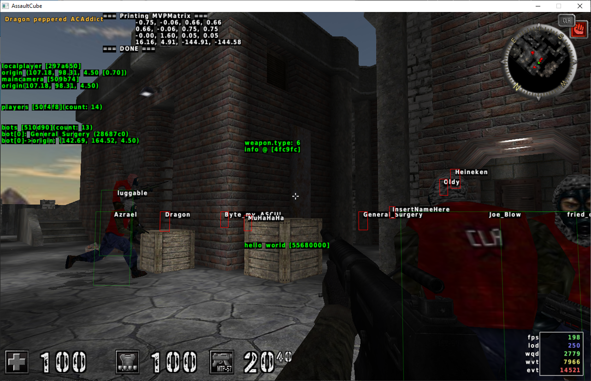
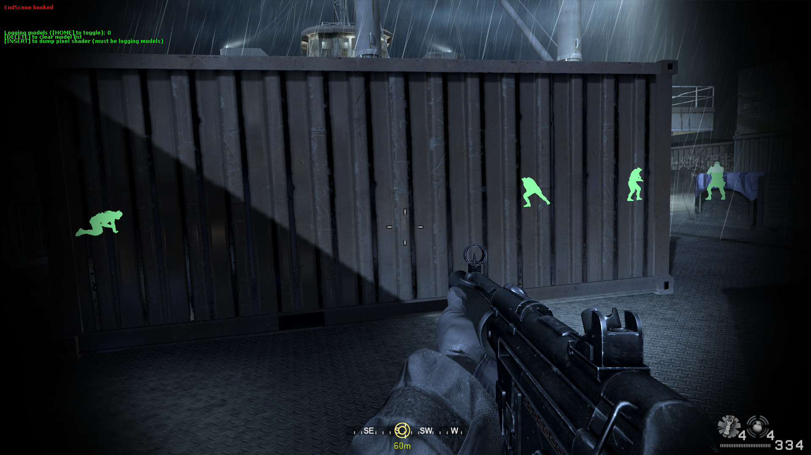

# "how 2maek esp???" #

An ESP cheat (short for extra-sensory perception) is one that provides you with some information you wouldn't normally have. Typically this is implemented as a bounding box drawn around players even if you don't have line of sight on that player. Sometimes instead of a bounding box it'll be an outline or even overriding the drawing of the player texture to draw it as a bright color with depth disabled (this last example is commonly referred to as 'chams'). You could even draw a radar - providing a top-down view of the world and the positions of the players on it.

|  |
|:--:|
| Image: Name & Box ESP w/ some debug info drawn on screen | 

## Different Ways to Draw ##

Drawing can be accomplished by taking one of many paths. 
You can hook a game's core drawing function and make use of its own drawing functions. 
You can hook directX's Present function or openGL's wglSwapBuffers function (or whatever other function that gets called every frame - I don't have much experience with openGL) and do your own drawing, too. You could initialize imgui and use imgui's drawing functions or write your own. 

### TO-DO ###
- [ ] Detailed walkthrough of setting up a directx and openGL hook

## Requirements for an ESP (Internal) ##
This assumes you're already able to inject your code into the process, so the requirements for injection won't be listed. 
This also assumes you only want to draw a string at each player's position (name ESP).
1. A game function you can hook that gets called every frame.
	<ol type="a">
	<li>For engine drawing: a render function you can hook. Ideally, this function will already have the proper graphics state setup for drawing. If not, then you may have to figure out how to set up the graphics state yourself (and then set it back to whatever it was before your hook calls the original).</li>
	</ol>
2. A draw text function. This can either be: finding an engine function to call, writing your own via openGL / directX, or using a library like imgui.
3. The address of the local player instance.
4. The address of the player list or entity list.
	<ol type="a">
	<li>If entity list: figuring out enough of the entity struct to be able to determine what <em>type</em> of entity it is.</li>
	</ol>
5. Figuring out enough of the player / entity struct to read its position.
6. Some way to calculate screen coords from world coords. This can either be: finding an engine function (often named Deproject or something with Transform in it), finding the model view projection matrix, or constructing the model view projection matrix by finding its component values (or making educated guesses).

Once you break the task down into small steps like this it doesn't seem so difficult, right? I like to copy this check-list into every new project I work on. 
Now I'll try to explain the biggest challenge of ESP: the world to screen transformation.

## World to Screen ##
Player positions are kept in world coordinates. We usually draw things using screen coordinates. So we need to figure out how to transform world coordinates to screen coordinates. Thankfully, the game must also do this as part of its rendering pipeline (the GPU has no idea about world space, it only knows screen space) and so important data structures used in this transformation should already be present for us to use. That would be the model, view, and projection matrices. 
**The model matrix** (also known as the world matrix) is a matrix representing the transformation from model space to world space. Model space is the space the artist was working with in their modeling software when building the model. Its inputs include the position, rotation, and scale of the object. 
**The view matrix** is the inverse of the camera object's world matrix. It's responsible for transforming world-space into camera-space (also known as view-space). Essentially, it positions objects to be relative to the camera, including the camera object itself which will be positioned at the identity matrix (0,0 staring down the Z axis). Different cameras are positioned differently. FPS cameras are usually positioned at the player position plus an offset to make it "eye-level". TPS cameras can be positioned looking over the top of the player's shoulder, or they can be freely orbitable around the player at a fixed or variable distance. A look-at camera is used in games that feature a lock-on system. Keeping these differences in mind can make it easier to track down or guess at the construction of the view matrix. Also keep in mind some games might not represent the camera as a separate 'object' in the scene but the principles remain. 
**The projection matrix** is set up when initializing the perspective projection of the scene. Its inputs include horizontal and vertical FOV, aspect ratio (screen width divided by screen height), and near and far clipping planes. This is probably where the most math comes from and I suck at math so I can't even explain how perpsective projection works. Thankfully, you don't need to be a mathematician nowadays because all of it is wrapped up neatly into nearly every graphics API or library. We just need to guess at what inputs the game uses. 
Common horizontal FOV values are 65, 80, and 90 but I've noticed more modern games are experimenting with all kinds of different values here. Of course, the FOV is also often adjustable by the user in the game settings. 
Vertical FOV is usually calculated from the horizontal FOV, but I think I've seen some games allow the user to adjust both independently. 
The near clipping plane value is usually 0.10 or 0.30 and the far clipping plane value is usually a much larger number like 100.00, 450.00, or even 1000.00.

By multiplying all three matrices together and then multiplying that by our world position we'll get our converted screen position. The Z component (or W component depending on how you do your multiplication) tells us whether the object will be clipped or not (if it's off-screen it'll have a value of zero [or less? I usually just check if it's less than 0.1]). 
There is a lot of math involved and I have really weak math skills so I do a lot of trial-and-error and guesswork for this. Every time, every game. I have no shame in this, I only wish I paid more attention in math class. Don't feel bad if you need to google or copy-paste other people's world to screen functions. Just give credit when you do.

## Externals ##

This guide usually assumes you're making an internal cheat: one that you inject into the game process. However, external cheats are quite common and can be just as effective, too. 
For externals, you'll want to create an invisible window overlaying the game window. From there you can setup whatever graphics API you'll be using: GDI, directX, openGL, or imgui on top of any of those. 
Other than that, you'll still face the same requirements of needing to iterate the player / entity list, reading player positions, and transforming world positions to screen positions.

### TO-DO ###
- [ ] Make note of strange wording in winapi functions dealing with 'transparency', and how to properly set up the invisible overlay window.

## Chams ##

Chams are quite a distinctive ESP cheat and they can be somewhat universal too with hardly any additional coding required for different games. 
The idea is to hook DrawIndex or DrawIndexedInstance as these are called per-model, and then in your hook call IAGetVertexBuffers, IAGetIndexBuffer, PSGetConstantBuffers, and VSGetConstantBuffers and use as many unique values as you can to identify specific models. Once you've identified the values associated with player models then you can filter those and call OMSetDepthStencilState and PSSetShader to draw that model as a flat color with no depth (so you can see it even through walls). 
Keep in mind that things like LOD or texture streaming can result in a model having multiple sets of values depending on how far away it is or other in-game conditions, which is one of the biggest drawbacks of this method. 
Ah, this section assumed directx, but I'm sure equivalent functions exist in openGL too.

|  |
|:--:|
| Image: Chams have a unique visual appeal | 

### TO-DO ###

- [ ] how to do the same in openGL

## Summary and Tips ##

Rendering is an extremely complex and deep subject, but as you've seen we can leverage what's given to us to simplify the work considerably. 
If you're interested in graphics programming, I'd recommend checking out [this series of free tutorials](https://www.rastertek.com/tutdx11.html) that walks you through setting up directX, importing and parsing 3D models, importing and parsing textures, and various important graphics techniques like lighting, culling, reflections, particle effects, and more.

### TO-DO ###
- [ ] Include tip on how to find player / entity list